# jenkins安装

>## java 安装
>
>## tomcat 安装
>
>## jenkins 安装
>
>>### jenkins下载
>>
>>war包地址:  <https://www.jenkins.io/download/>
>>下载后放到tomcat webapps 目录下
>>修改tomcat:  vim bin/catalina.sh 
>>找到JAVA_OPTS后增加一行
>>JAVA_OPTS="$JAVA_OPTS -Dhudson.util.ProcessTree.disable=true"
>>防止jenkins杀死脚本子进程
>>修改tomcat: vim conf/context.xml
>><Resources cachingAllowed="true" cacheMaxSize="200000"/>
>>防止启动后提示告警信息
>>启动tomcat:bin/startup.sh
>>查看jenkins启动日志：vim logs/catalina.out
>>找到初始化密码复制下来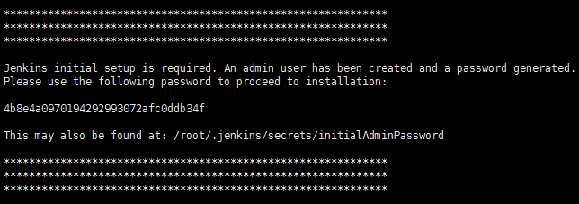
>>打开访问页面http://xxxx.8080/jenkins
>>输入初始化密码后修改密码
>>安装jenkins基础插件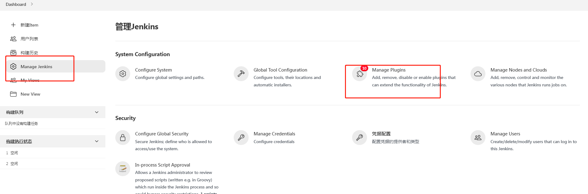
>
>## 创建项目，默认第一个就行
>
>> 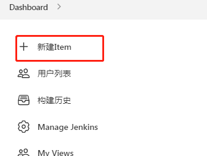
>>
>> ## 源码管理，我选择的是git
>>
>> 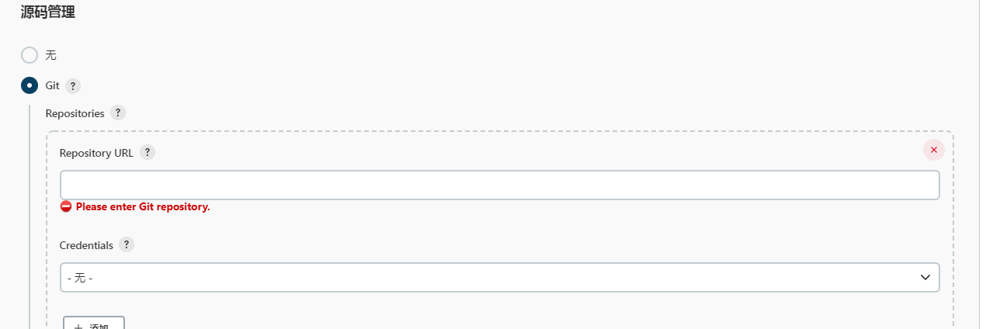
>> 这里的Credentials可以选择在全局凭据中配置，如果不选择的话默认使用的就是启动jenkins用户的默认环境
>> 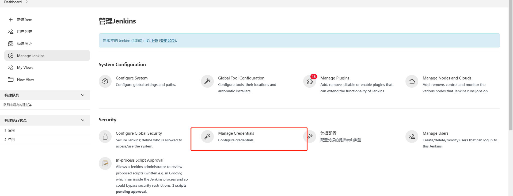
>> git仓库可以使用用户名密码，或者sshkey，关于sshkey不同仓库的加密方式不同,请自行去仓库中查找
>>
>> ## 选择要构建的分支
>>
>> 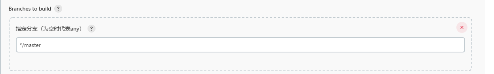
>>
>> ## 构建，选择执行shell命令
>>
>> 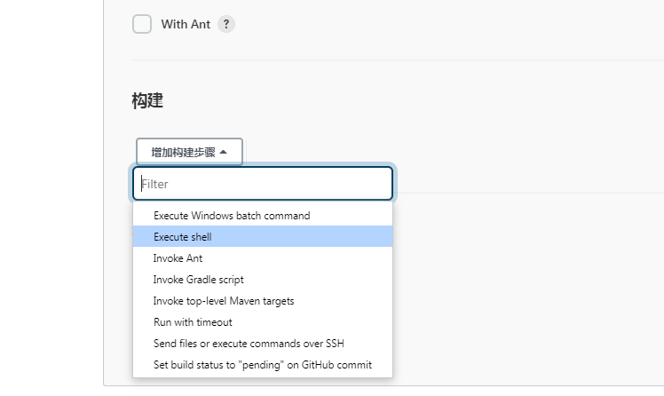
>> 通常会需要更新测试环境，根据情况编写构建脚本
>> 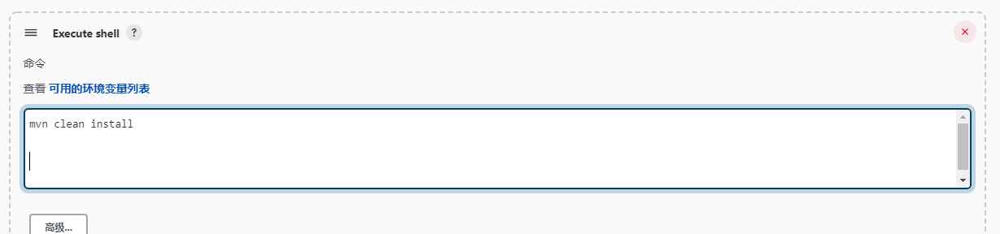
>> 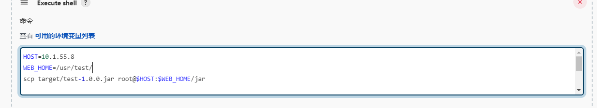
>>
>> ## 备份构建结果
>>
>> 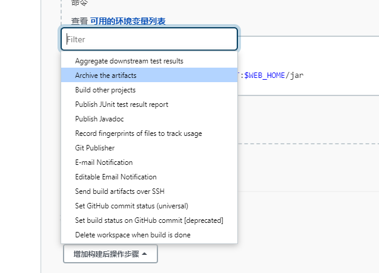
>> 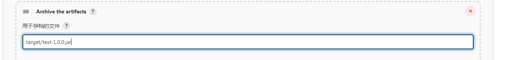
