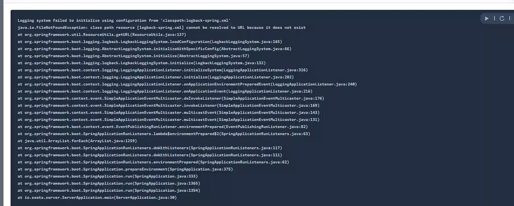
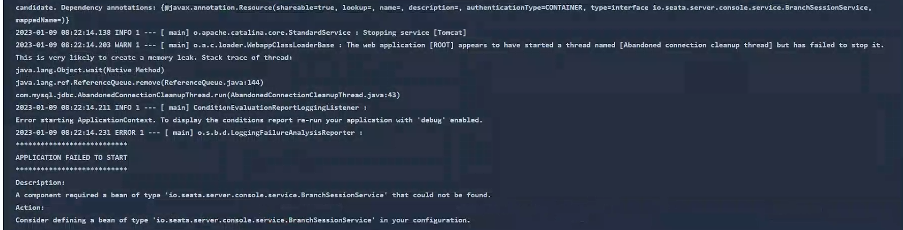
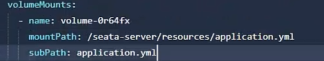

测试环境使用的kubeSphere x86架构, 使用的镜像包是seata1.3版本的,使用的registry.conf的配置方式,
生产环境的kubeSphere是arm架构的, 由于1.3版本的镜像不支持arm架构,所以将镜像更换为seata1.6-arm,升级后无法读取到配置文件内容,
查询资料后得知seata1.5版本后配置文件修改变成了application.yml,
复制容器内/seata-server/resources/application.yml文件内容进行修改,将配置文件映射目录修改为/seata-server/resources,
修改后启动镜像出现问题 Logging system failed to initialize using configuration from 'classpath:logback-spring.xml'
>> 

于是将配置文件中logging.conf注释掉,重新启动镜像又出现问题 A component required a bean of type 'io.seata.server.console.service.BranchSessionService' that could not found
>> 

网上搜索问题后猜测是因为未读取到resources目录下的文件导致的(其实从第一次报错就可以猜到了，只不过当时觉得是其他问题导致的，所以进行了第一次修改)
后又查询资料得知kubeSphere进行配置文件映射时默认会将容器内的整个目录替换成映射的目录内容,于是查询只进行单个文件的映射方式,需要配置subPath

>> 

修改后正常启动
